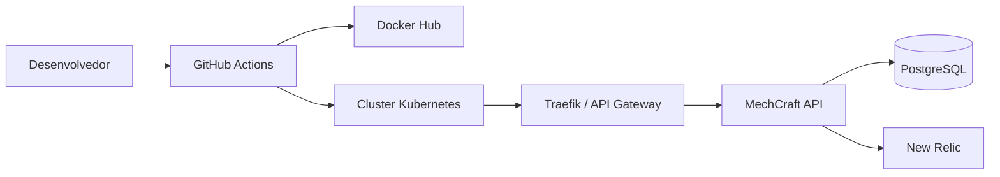

# Arquitetura Do Repositorio Da Aplicacao

## Escopo deste repositorio

- Codigo-fonte da API NestJS.
- Dockerfile e docker-compose para desenvolvimento local.
- Manifests Kubernetes da aplicacao.
- Gateway HTTP para roteamento do endpoint de autenticacao CPF.
- Integracao com New Relic no cluster.
