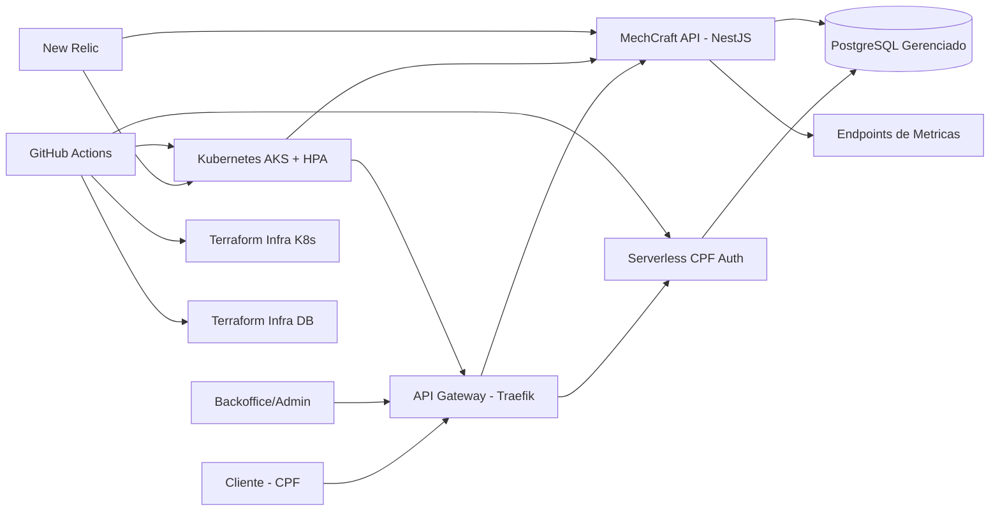

# Diagrama de Componentes

```mermaid
flowchart LR
  Client[Cliente - CPF] --> APIGW[API Gateway - Traefik]
  Backoffice[Backoffice/Admin] --> APIGW
  APIGW --> Lambda[Serverless CPF Auth]
  APIGW --> API[MechCraft API - NestJS]

  Lambda --> DB[(PostgreSQL Gerenciado)]
  API --> DB

  API --> Metrics[Endpoints de Metricas]
  K8s[Kubernetes AKS + HPA] --> API
  K8s --> APIGW

  Observability[New Relic] --> K8s
  Observability --> API

  CICD[GitHub Actions] --> Lambda
  CICD --> K8s
  CICD --> TerraformK8s[Terraform Infra K8s]
  CICD --> TerraformDB[Terraform Infra DB]
```

