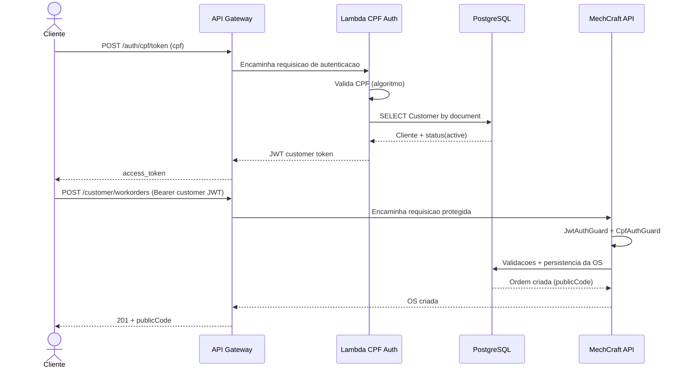

# Diagrama de Sequencia - Autenticacao CPF e Abertura de OS

```mermaid
sequenceDiagram
  actor Cliente
  participant Gateway as API Gateway
  participant Lambda as Lambda CPF Auth
  participant DB as PostgreSQL
  participant API as MechCraft API

  Cliente->>Gateway: POST /auth/cpf/token (cpf)
  Gateway->>Lambda: Encaminha requisicao de autenticacao
  Lambda->>Lambda: Valida CPF (algoritmo)
  Lambda->>DB: SELECT Customer by document
  DB-->>Lambda: Cliente + status(active)
  Lambda-->>Gateway: JWT customer token
  Gateway-->>Cliente: access_token

  Cliente->>Gateway: POST /customer/workorders (Bearer customer JWT)
  Gateway->>API: Encaminha requisicao protegida
  API->>API: JwtAuthGuard + CpfAuthGuard
  API->>DB: Validacoes + persistencia da OS
  DB-->>API: Ordem criada (publicCode)
  API-->>Gateway: OS criada
  Gateway-->>Cliente: 201 + publicCode
```

