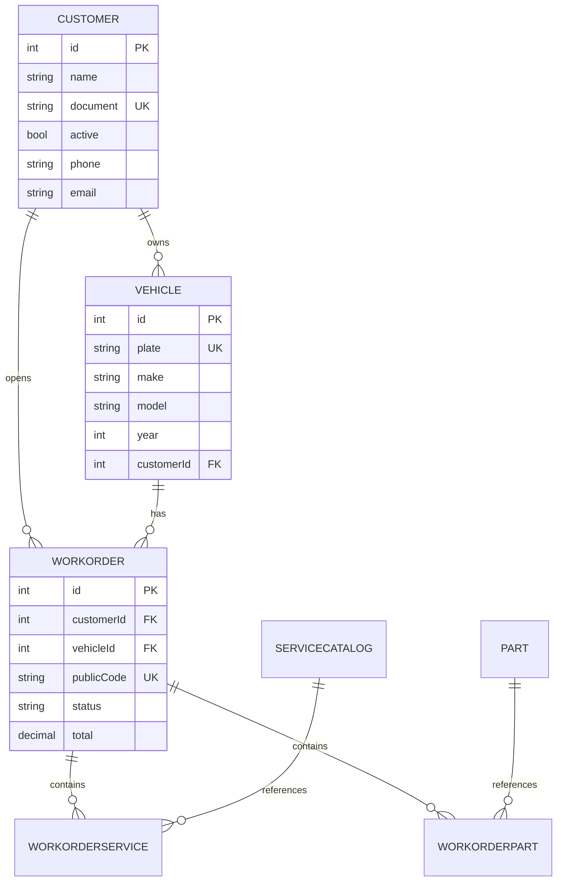

# Diagrama ER

```mermaid
erDiagram
  CUSTOMER ||--o{ VEHICLE : owns
  CUSTOMER ||--o{ WORKORDER : opens
  VEHICLE ||--o{ WORKORDER : has
  WORKORDER ||--o{ WORKORDERSERVICE : contains
  WORKORDER ||--o{ WORKORDERPART : contains
  SERVICECATALOG ||--o{ WORKORDERSERVICE : references
  PART ||--o{ WORKORDERPART : references

  CUSTOMER {
    int id PK
    string name
    string document UK
    bool active
    string phone
    string email
  }

  VEHICLE {
    int id PK
    string plate UK
    string make
    string model
    int year
    int customerId FK
  }

  WORKORDER {
    int id PK
    int customerId FK
    int vehicleId FK
    string publicCode UK
    string status
    decimal total
  }
```

